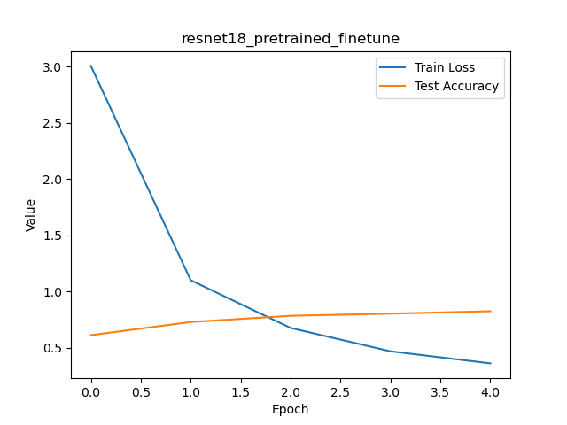
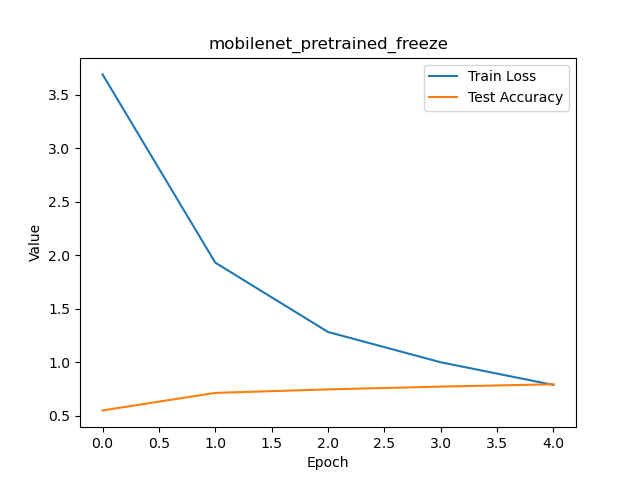
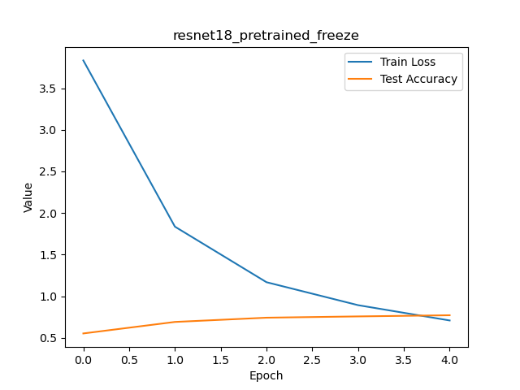
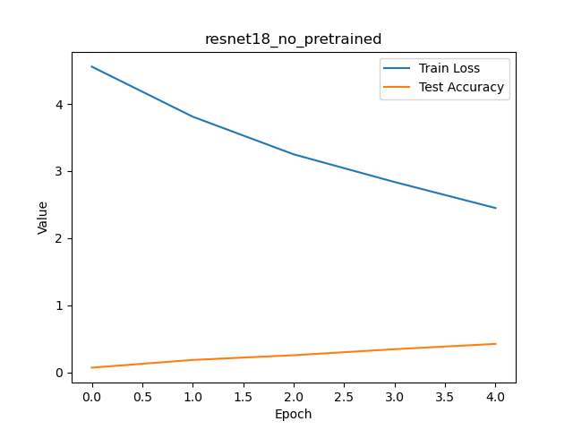

#  Pokemon Image Classifier (Transfer Learning)

##  프로젝트 설명
이 프로젝트는 딥러닝의 **Transfer Learning** 기법을 활용하여  
포켓몬 이미지를 입력하면 해당 포켓몬의 이름을 예측하는 이미지 분류 모델이다.

PyTorch를 이용하여 여러 모델을 비교 실험하고,  
Streamlit을 통해 간단한 GUI 데모를 구현하였다.

---

##  주요 기능
- 포켓몬 이미지 입력 시 Top-5 예측 결과 출력
- Transfer Learning 기반 모델 학습
- 4가지 실험 설정 비교
- Streamlit GUI 제공

---

##  사용 기술
- Python
- PyTorch
- torchvision (ResNet18, MobileNetV2)
- Streamlit

---

##  실험 결과

| Experiment | Accuracy | Precision | Recall |
|----------|---------|----------|--------|
| ResNet18 (Pretrained + Freeze) | 77.06% | 81.90% | 76.68% |
| ResNet18 (Pretrained + Fine-tuning) | **82.59%** | **86.77%** | **82.30%** |
| MobileNet (Pretrained + Freeze) | 79.44% | 81.32% | 79.13% |
| ResNet18 (No Pretraining) | 42.66% | 49.60% | 42.20% |

 **Pretrained + Fine-tuning 모델이 가장 높은 성능을 보였다.**

---

##  Learning Curve

### ResNet18 (Fine-tuning)

### MobileNet (Freeze)

### ResNet18 (Freeze)

### ResNet18 (No Pretraining)

---

##  실행 방법

### 1. 라이브러리 설치
bash -> pip install -r requirements.txt

### 2. 모델 학습
bash -> python train.py

### 3. GUI 실행
bash -> streamlit run app.py

---

##  실행 결과

---

##  결론

Transfer Learning을 활용한 모델이
처음부터 학습한 모델보다 훨씬 높은 성능을 보였다.
특히 fine-tuning을 적용했을 때 가장 좋은 결과를 얻을 수 있었다.

---
